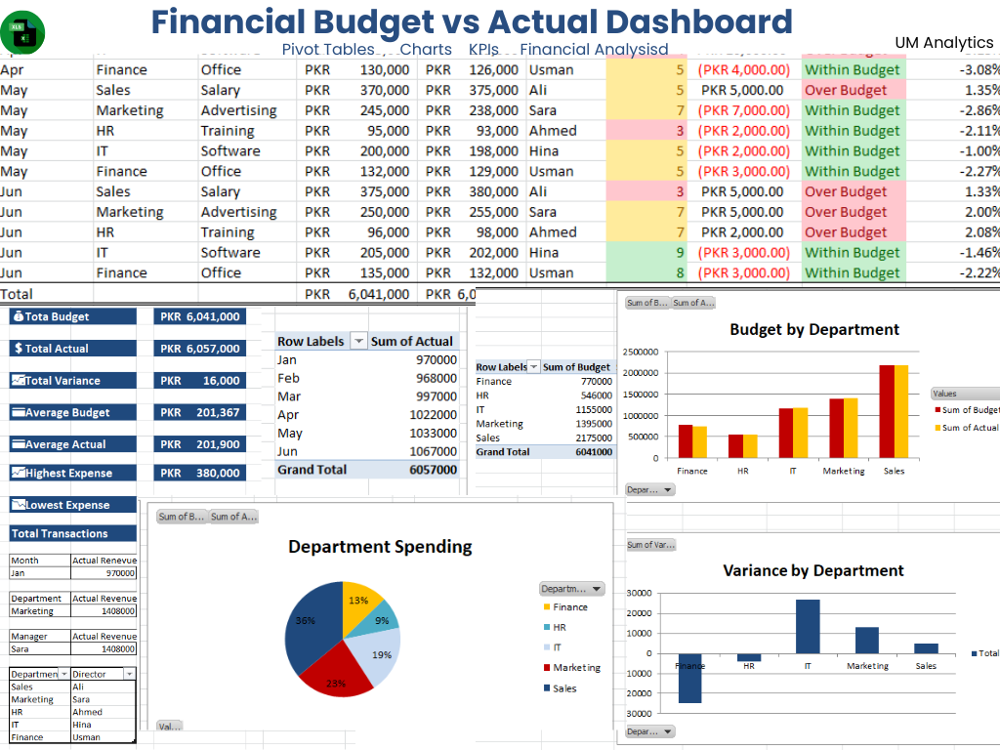

# Financial Budget vs Actual Dashboard

An interactive Financial Budget vs Actual Dashboard built in Microsoft Excel to compare planned budgets with actual financial performance and identify variances.

---

#Preview

## Dashboard Features

- Budget vs Actual Comparison
- Financial KPIs
- Variance Analysis
- Department-wise Performance
- Monthly Trends
- Interactive Charts
- Pivot Tables
- Slicers

---

## Tools Used

- Microsoft Excel
- Pivot Tables
- Pivot Charts
- Excel Formulas
- Conditional Formatting
- Data Visualization

---

## Skills Demonstrated

- Financial Analysis
- Budget Analysis
- Dashboard Design
- KPI Reporting
- Data Visualization

---

## Project Files

- Financial Budget vs Actual Dashboard.xlsx
